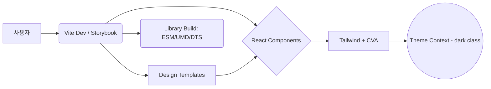

# Technical Requirements Document (TRD)

## 1. Executive Technical Summary
- **Project Overview**: 개인 개발자를 위한 경량 디자인 시스템. React 19 + Vite + Tailwind CSS(+CVA)로 구성 요소를 빠르게 탐색·재사용할 수 있는 라이브러리와 데모/문서화 환경(Storybook, Vite dev)을 제공합니다.
- **Core Technology Stack**: React 19, Vite 5, Tailwind CSS 3.4, CVA, TypeScript 5, Storybook 8, Vitest + Testing Library
- **Key Technical Objectives**: 고성능 번들(트리셰이킹/코드스플리팅), 변이(variant) 일관성, 다크 모드 지원, 재사용성·접근성·타입 안정성 확보.
- **Critical Technical Assumptions**: 기본 웹/React 지식 보유, Tailwind 유틸리티 및 CVA 변이 패턴에 익숙함을 가정.

## 2. Tech Stack

| Category          | Technology / Library        | Reasoning (Why it's chosen for this project) |
| ----------------- | --------------------------- | -------------------------------------------- |
| Framework/Build   | Vite 5 (React 19)           | 경량 번들러, 빠른 HMR, 라이브러리 모드(dts) 지원 |
| UI Library        | React 19                    | 함수형 컴포넌트 + 훅 기반 재사용성 |
| Styling           | Tailwind CSS 3.4 + CVA      | 유틸리티 + 변이 관리로 일관성/확장성 확보 |
| State Management  | React Context API (최소)    | 테마 토글 등 경량 글로벌 상태에 적합 |
| Component Library | 내부 컴포넌트 + CVA 변이    | 원자적 설계(Atoms~Templates) 기반 라이브러리화 |
| Icons             | React Icons                 | 다양한 아이콘 소스 통합 |
| Testing           | Vitest + Testing Library    | 빠른 실행, DOM 시뮬레이션(jsdom) |
| Docs              | Storybook 8                 | 컴포넌트 문서/데모, 인터랙션 테스트 |

## 3. System Architecture Design

### Top-Level building blocks
- **Library Build (Vite)**
    - UI Component Library: Tailwind + CVA 기반 재사용 컴포넌트 (버튼, 폼, 네비게이션, 데이터 디스플레이, 알림, 템플릿 등)
    - Entry: `src/index.ts` → ESM/UMD + DTS 번들
- **Dev Playground (Vite dev 서버)**
    - `src/dev/App.tsx`에서 모든 컴포넌트 탐색/데모
- **Docs (Storybook 8)**
    - 컴포넌트 문서, 인터랙션 테스트, 접근성 점검
- **Styling (Tailwind CSS)**
    - 전역 스타일: `src/index.css`, `styles/globals.css` (`@layer base`)
    - 다크 모드: Tailwind `dark` 클래스 전략
- **State Management**
    - React Context API 최소 사용 (테마 토글)
- **Distribution**
    - 라이브러리 패키지 번들 산출물: `dist/frontend-design-system.{es,umd}.js` + 타입 정의

### Top-Level Component Interaction Diagram



- **사용자 상호 작용**: 개발자는 Vite dev/Storybook에서 컴포넌트를 탐색·검증합니다.
- **스타일 적용**: Tailwind 유틸리티 + CVA 변이로 일관된 스타일을 적용합니다.
- **테마 적용**: Theme Context가 `document.documentElement`에 `dark` 클래스를 토글합니다.
- **배포 산출물**: Vite 라이브러리 빌드 결과(ESM/UMD/DTS)를 배포/배포 전 미리보기합니다.

### Code Organization & Convention
**Domain-Driven Organization Strategy**
- **Domain Separation**: 기능별 폴더 (예: `components/buttons`, `components/forms`, `components/navigation`).
- **Layer-Based Architecture**: 컴포넌트 / 스타일(Tailwind) / 유틸 / 컨텍스트 분리.
- **Shared Components**: 공통 유틸리티와 컨텍스트는 `src/shared`, `src/utils`에 배치.

**Universal File & Folder Structure**
```
/
├── src/
│   ├── components/          # 재사용 가능한 React 컴포넌트 (Tailwind + CVA)
│   ├── dev/                 # Vite 데모 엔트리 (App.tsx, main.tsx)
│   ├── shared/contexts/     # ThemeContext 등
│   └── utils/               # cn 등 유틸
├── providers/ThemeProvider.tsx
├── styles/                  # Tailwind 전역 스타일 (globals.css 등)
├── tailwind.config.js       # Tailwind 설정 (darkMode: 'class')
├── vite.config.ts           # Vite + dts 설정
└── src/index.ts             # 라이브러리 export 엔트리
```

### Data Flow & Communication Patterns
- **Client-Only Dev Playground**: Vite dev에서 스토리/데모를 렌더링.
- **Storybook Docs**: 스토리/MDX 기반 컴포넌트 데모 및 인터랙션.
- **State Sharing**: ThemeContext 등 경량 컨텍스트 사용, 나머지는 props 기반 단방향 데이터 흐름.
- **External Data**: 기본적으로 없음. 데모용 mock 데이터만 사용.

## 4. Performance & Optimization Strategy
- **Code Splitting**: Vite/ESM 기반 트리셰이킹, 필요한 경우 지연 로딩 가능.
- **Style Optimization**: Tailwind JIT로 사용 클래스만 번들링.
- **Bundle Output**: ESM/UMD 이중 타깃, 외부 의존성(`react`, `react-dom`) external 처리.
- **Memoization**: React.memo, useMemo/useCallback으로 불필요한 리렌더 방지.

## 5. Implementation Roadmap & Milestones
### Phase 1: Foundation (MVP Implementation)
- **Core Infrastructure**: Vite 설정, Tailwind + CVA 세팅, ESLint/TS 설정
- **Essential Features**: 핵심 UI 컴포넌트(버튼, 폼, 네비게이션, 데이터 디스플레이, 피드백, 오버레이, 템플릿)
- **Docs/Playground**: Storybook, Vite dev 플레이그라운드
- **Timeline**: 4주

### Phase 2: Feature Enhancement
- **Advanced Features**: 추가 변이/템플릿, 사이드바 기반 구성요소 탐색, 디자인 토큰 정리
- **Performance Optimization**: 번들 사이즈 모니터링, 불필요 의존성 제거
- **Docs 확장**: Storybook 스토리 보강, 코드샌드박스/플레이그라운드 개선
- **Timeline**: 6주

## 6. Risk Assessment & Mitigation Strategies
### Technical Risk Analysis
- **Technology Risks**: Tailwind/CVA 패턴 미숙 → 가이드라인/스토리 제공
- **Performance Risks**: 번들 부피 증가 → external 설정, 트리셰이킹, 사용 클래스 최소화
- **Security Risks**: 데모 영역에서의 XSS → 입력 렌더링 시 escape 또는 제한
- **Integration Risks**: 외부 의존 최소로 리스크 낮음
- **Mitigation Strategies**:
    - 변이 패턴 및 Tailwind 컨벤션 문서화
    - 번들 사이즈 모니터링 및 의존성 정리
    - 데모 입력은 제한/검증 처리
    - CI에 lint/test 추가 (선택)

### Project Delivery Risks
- **Timeline Risks**: 컴포넌트/스토리 확장 지연 → 필수 변이 우선순위화
- **Resource Risks**: 단독 개발 시 속도 저하 → 자동화된 lint/test 활용
- **Quality Risks**: 테스트 부족 → 핵심 상호작용에 대한 Vitest/RTL 추가
- **Deployment Risks**: 번들/타입 실패 → `pnpm build`/`pnpm test` CI 훅
- **Contingency Plans**:
    - 범위 축소: 핵심 컴포넌트·변이 우선
    - 정적 타입/테스트 강화로 회귀 방지
    - 실패 시 마지막 성공 빌드로 롤백

