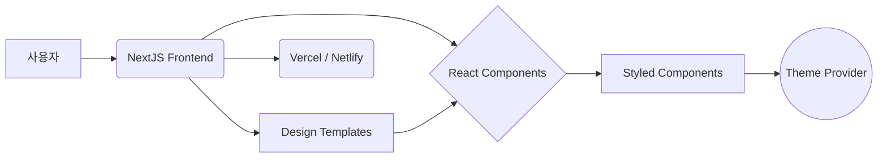

# Technical Requirements Document (TRD)

## 1. Executive Technical Summary
- **Project Overview**: 본 프로젝트는 프론트엔드 개발자들이 디자인 전문 지식 없이도 빠르고 세련된 웹사이트 및 애플리케이션을 구축할 수 있도록 지원하는 디자인 시스템을 구축하는 것을 목표로 합니다. ReactJS와 NextJS를 활용하여 재사용 가능한 UI 컴포넌트 라이브러리와 디자인 템플릿을 제공하여 개발 생산성을 향상시키고 사용자 정의를 용이하게 합니다.
- **Core Technology Stack**: ReactJS, NextJS
- **Key Technical Objectives**: 고성능, 빠른 로딩 시간, 쉬운 사용자 정의 및 확장성을 목표로 합니다.
- **Critical Technical Assumptions**: 개발자들이 기본적인 웹 개발 지식(HTML, CSS, JavaScript)을 가지고 있으며, 컴포넌트 기반 개발 방식에 익숙하다고 가정합니다.

## 2. Tech Stack

| Category          | Technology / Library        | Reasoning (Why it's chosen for this project) |
| ----------------- | --------------------------- | -------------------------------------------- |
| Framework         | NextJS                      | 서버 사이드 렌더링 (SSR) 및 정적 사이트 생성 (SSG)을 지원하여 초기 로딩 속도 향상 및 SEO 최적화에 유리합니다. |
| UI Library        | ReactJS                     | 컴포넌트 기반 아키텍처를 통해 재사용 가능한 UI 컴포넌트 개발에 용이하며, 활발한 커뮤니티 지원 및 다양한 라이브러리 활용이 가능합니다. |
| Styling           | Styled Components           | CSS-in-JS 방식을 통해 컴포넌트 스타일을 캡슐화하고, 동적인 스타일링 및 테마 관리를 용이하게 합니다. |
| State Management  | React Context API           | 비교적 간단한 상태 관리를 위해 React 내장 Context API를 활용합니다.  더 복잡한 상태 관리가 필요한 경우 Redux 또는 Zustand를 고려할 수 있습니다. |
| Component Library | Material UI / Ant Design (Customized) | Material UI 또는 Ant Design을 기반으로 시작하여 필요한 컴포넌트를 커스터마이징하여 사용합니다. 디자인 시스템의 일관성을 유지하면서 개발 시간을 단축할 수 있습니다. |
| Icons             | React Icons                 | 다양한 아이콘 라이브러리를 쉽게 사용할 수 있도록 지원합니다. |
| Testing           | Jest, React Testing Library | 컴포넌트의 기능 및 UI를 테스트하기 위한 도구입니다. |

## 3. System Architecture Design

### Top-Level building blocks
- **Frontend (NextJS Application)**
    - UI Component Library: 재사용 가능한 React 컴포넌트 (버튼, 폼 요소, 네비게이션, 데이터 디스플레이, 알림, 아바타 등)
    - Design Templates: 페이지 레이아웃 및 일반적인 UI 패턴 템플릿
    - Routing: NextJS의 파일 기반 라우팅 시스템을 사용하여 페이지 간 이동 관리
    - State Management: React Context API를 사용하여 컴포넌트 간 상태 공유 및 관리
- **Styling (Styled Components)**
    - Theme Provider: 디자인 시스템의 테마를 관리하고 컴포넌트에 적용
    - Global Styles: 전체 애플리케이션에 적용되는 기본 스타일 설정
    - Component Styles: 각 컴포넌트의 스타일 정의 및 관리
- **Deployment (Vercel / Netlify)**
    - CI/CD Pipeline: 코드 변경 시 자동으로 빌드 및 배포
    - Hosting: 애플리케이션을 호스팅하고 사용자에게 제공

### Top-Level Component Interaction Diagram



- **사용자 상호 작용**: 사용자는 NextJS 프론트엔드 애플리케이션과 상호 작용합니다.
- **컴포넌트 렌더링**: NextJS는 React 컴포넌트를 렌더링하고, Styled Components를 통해 스타일을 적용합니다.
- **테마 적용**: Theme Provider는 디자인 시스템의 테마를 컴포넌트에 적용합니다.
- **배포**: Vercel 또는 Netlify를 통해 애플리케이션이 배포됩니다.

### Code Organization & Convention
**Domain-Driven Organization Strategy**
- **Domain Separation**: 컴포넌트를 기능별로 분리합니다 (예: `components/buttons`, `components/forms`, `components/navigation`).
- **Layer-Based Architecture**: 컴포넌트, 스타일, 데이터 로직을 분리합니다.
- **Feature-Based Modules**: 페이지 또는 특정 기능에 관련된 컴포넌트와 로직을 함께 그룹화합니다 (예: `pages/portfolio`, `components/portfolio`).
- **Shared Components**: 공통으로 사용되는 유틸리티, 타입, 재사용 가능한 컴포넌트는 `shared` 디렉토리에 저장합니다.

**Universal File & Folder Structure**
```
/
├── components/              # 재사용 가능한 React 컴포넌트
│   ├── buttons/           # 버튼 컴포넌트
│   │   ├── Button.tsx
│   │   ├── Button.test.tsx
│   │   └── index.ts
│   ├── forms/             # 폼 요소 컴포넌트
│   │   ├── TextField.tsx
│   │   ├── Dropdown.tsx
│   │   └── ...
│   ├── navigation/        # 네비게이션 컴포넌트
│   │   ├── Menu.tsx
│   │   ├── Tabs.tsx
│   │   └── ...
│   └── ...
├── app/                    # NextJS App Router pages
│   ├── layout.tsx         # Root layout
│   ├── page.tsx           # Home page
│   └── ...
├── styles/                 # 전역 스타일 및 테마
│   ├── globals.css        # 전역 CSS 스타일
│   ├── theme.ts           # 테마 정의
│   └── GlobalStyles.ts    # Styled Components global styles
├── public/                 # 정적 파일 (이미지, 폰트 등)
│   ├── images/
│   ├── fonts/
│   └── ...
├── shared/                 # 공유 유틸리티 및 컨텍스트
│   ├── contexts/         # React Context providers
│   └── ...
├── .eslintrc.js            # ESLint 설정
├── next.config.js          # NextJS 설정
└── package.json            # 프로젝트 의존성 및 스크립트
```

### Data Flow & Communication Patterns
- **Client-Server Communication**: NextJS의 `getServerSideProps` 또는 `getStaticProps`를 사용하여 서버에서 데이터를 가져와 컴포넌트에 전달합니다.
- **Database Interaction**: 필요에 따라 API를 통해 데이터베이스와 상호 작용합니다. (본 프로젝트에서는 데이터베이스가 필수는 아님)
- **External Service Integration**: 필요에 따라 외부 API를 호출하여 데이터를 가져옵니다. (예: 이미지 CDN)
- **Real-time Communication**: 본 프로젝트에서는 실시간 통신이 필요하지 않습니다.
- **Data Synchronization**: 데이터 동기화는 필요에 따라 API 호출을 통해 수행합니다.

## 4. Performance & Optimization Strategy
- **Code Splitting**: NextJS의 자동 코드 분할 기능을 활용하여 초기 로딩 시간을 단축합니다.
- **Image Optimization**: 이미지 CDN을 사용하여 이미지 크기를 최적화하고, Lazy Loading을 적용하여 초기 로딩 시 불필요한 이미지 로딩을 지연시킵니다.
- **Caching**: `getStaticProps`를 사용하여 정적 데이터를 캐싱하고, `getServerSideProps`를 사용하여 서버 사이드 렌더링된 페이지를 캐싱합니다.
- **Memoization**: React.memo를 사용하여 불필요한 컴포넌트 렌더링을 방지합니다.

## 5. Implementation Roadmap & Milestones
### Phase 1: Foundation (MVP Implementation)
- **Core Infrastructure**: NextJS 프로젝트 설정, 기본 폴더 구조 구축, ESLint 설정
- **Essential Features**: 기본 UI 컴포넌트 (버튼, 텍스트 필드, 드롭다운), 기본 페이지 레이아웃, 스타일 가이드 정의
- **Basic Security**: 기본적인 보안 설정 (CORS, XSS 방지)
- **Development Setup**: 개발 환경 설정, CI/CD 파이프라인 구축 (Vercel / Netlify)
- **Timeline**: 4주

### Phase 2: Feature Enhancement
- **Advanced Features**: 고급 UI 컴포넌트 (테이블, 리스트, 카드, 알림, 아바타), 디자인 템플릿 추가, 테마 시스템 구현
- **Performance Optimization**: 이미지 최적화, 코드 분할, 캐싱 전략 적용
- **Enhanced Security**: 고급 보안 기능 구현 (CSRF 방지, Rate Limiting)
- **Monitoring Implementation**: 오류 로깅 및 성능 모니터링 설정
- **Timeline**: 6주

## 6. Risk Assessment & Mitigation Strategies
### Technical Risk Analysis
- **Technology Risks**: ReactJS 및 NextJS에 대한 숙련도 부족, Styled Components 사용 시 성능 문제 발생 가능성
- **Performance Risks**: 컴포넌트 렌더링 성능 저하, 초기 로딩 시간 증가
- **Security Risks**: XSS, CSRF 공격에 취약할 가능성
- **Integration Risks**: 외부 API 의존성으로 인한 장애 발생 가능성
- **Mitigation Strategies**:
    - ReactJS 및 NextJS 학습 및 경험 축적
    - Styled Components 사용 시 성능 테스트 및 최적화
    - 보안 취약점 분석 및 방어 대책 마련
    - 외부 API 장애 대비를 위한 예외 처리 및 대체 API 구현

### Project Delivery Risks
- **Timeline Risks**: 개발 일정 지연, 예상치 못한 기술적 문제 발생
- **Resource Risks**: 개발 인력 부족, 기술 전문가 확보 어려움
- **Quality Risks**: 코드 품질 저하, 테스트 부족
- **Deployment Risks**: 배포 환경 문제 발생, 배포 실패
- **Contingency Plans**:
    - 개발 일정 지연 시 기능 축소 또는 우선순위 조정
    - 개발 인력 부족 시 추가 인력 확보 또는 외부 전문가 활용
    - 코드 품질 확보를 위한 코드 리뷰 및 테스트 강화
    - 배포 환경 문제 발생 시 롤백 전략 마련

